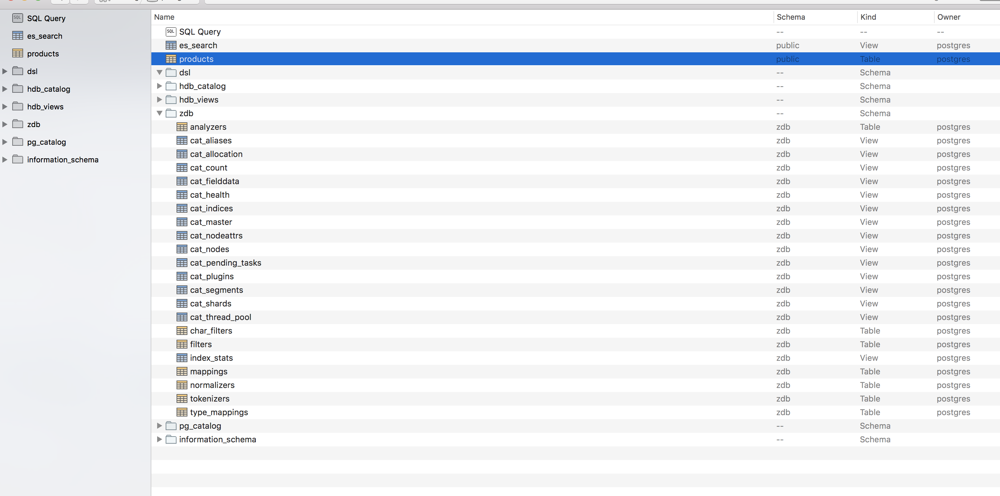
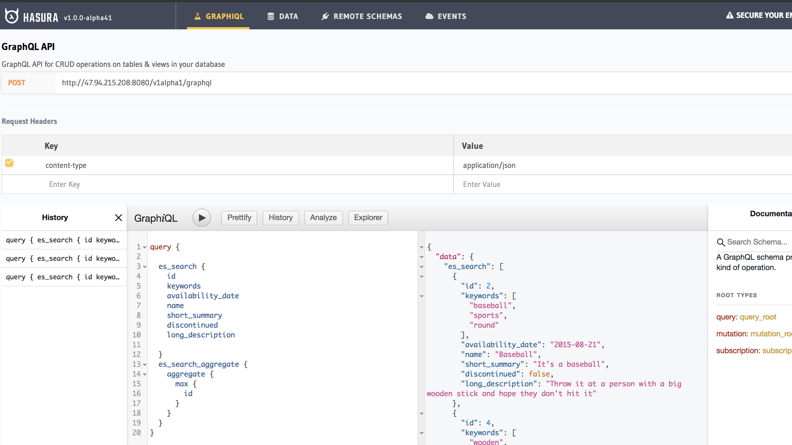
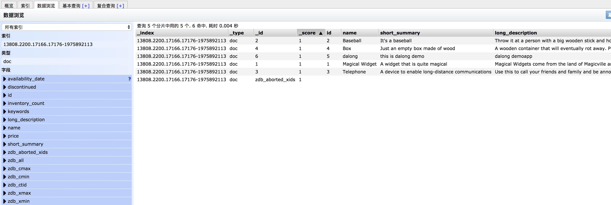

# zombodb with hasura-graphql

> this is a demo project just for test zombodb with hasura-graphql && use view for test zombodb with hasura-graphql

## how to running

> pg server && zombodb not runing with docker use vm

* install pg && zombodb

```code
see https://www.cnblogs.com/rongfengliang/p/10635311.html
```

* config  zombodb

```code
see https://www.cnblogs.com/rongfengliang/p/10635311.html
```

* start es server

> you may b econfig vm params see es/readme.md

```code
cd es && docker-compose up -d
```

* start hasura-graphql

> you must change pg server address see graphql-engine/readme.md

```code
docker-compose up -d
```

## some images





